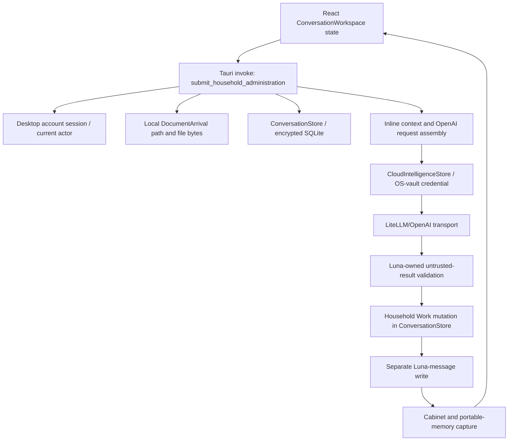
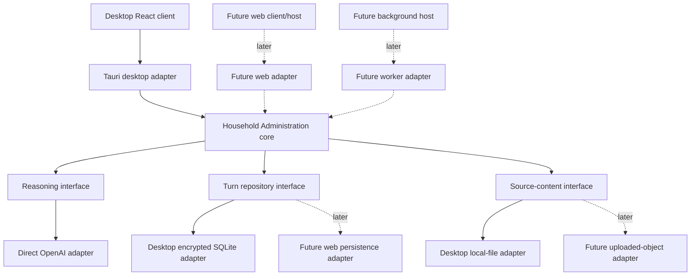

# Household Administration core extraction assessment

Status: first narrow extraction and direct OpenAI adapter implemented; headless live acceptance passed

Assessed implementation baseline: PR #76 extraction head `66ce7751c8f128b060feee4b87bf1b772e5958cd`

Scope: assessment plus the first narrow engine extraction; no broad runtime reorganisation is included

## Implementation update — 5 August 2026

The first narrow extraction is implemented in `desktop/src-tauri/src/household_administration/` behind the public interface:

```rust
HouseholdAdministrationEngine::handle_turn(HandleHouseholdAdministrationTurn)
```

The module now owns application-independent turn orchestration, recent-conversation loading, source loading through a logical reference, active and source-linked Household Work selection, request construction, untrusted-result validation, merge/no-op/terminal rules, Household Work audit events, persistence calls, natural response assembly and typed failure categories.

The production Tauri command delegates to the same interface through desktop adapters. For Household Administration reasoning it now constructs the direct OpenAI adapter from trusted runtime configuration rather than using Device PIN-bound gateway provisioning. Tauri retains session/actor validation, legacy `DocumentArrival` lookup and authorised review-card context translation, local bounded file loading, encrypted SQLite adapters and portable-memory compatibility capture. None of those types enters the engine input.

The implementation remains a coherent module in the existing Rust library rather than a new workspace crate. This is the smallest extraction that avoids a broad package reorganisation. The module itself imports no Tauri, SQLite, credential-vault, Cabinet, navigation, frontend or filesystem-path type. A later packaging change is still required before a web host can depend on a Rust crate that does not compile the surrounding desktop runtime.

Headless integration coverage is in `desktop/src-tauri/tests/household_administration_engine.rs`. Twelve deterministic tests pass without a Tauri runtime, Device PIN, OS vault, application launch or network. Six direct-adapter unit tests cover strict structured output, Luna-owned envelope metadata, PDF/image input, configuration/contract failure, provider error categories and partial clarification/correction instructions. Three ignored live diagnostics compose the same engine with fixture sources, in-memory persistence and `OpenAiHouseholdAdministrationReasoningAdapter`.

On 5 August 2026 all three live diagnostics passed using a dedicated project key loaded only into the test process and explicit `LUNA_OPENAI_MODEL=gpt-5.6`; the OpenAI response envelope identified `gpt-5.6-sol`. The first clarification run exposed a specific prompt defect: the provider repeated the complete fact set and resolved the member phrase to a generic authorised address instead of returning one member-supplied patch. The correction run was also nondeterministic at Luna's validation boundary. The smallest correction made the prompt state that `work.facts` is a patch, unchanged facts must not be repeated, unrelated fields stay null, and member clarification/correction values use exact member wording with conversation provenance. A deterministic transport-contract regression locks those instructions. Final clarification and correction each returned one `Property` patch for `work-1`, preserved unrelated facts and proposals and created no duplicate. The image-only PNG created and persisted new Household Work with visible provider, property, account, amount and due-date facts. No Tauri runtime, desktop UI, Device PIN, managed gateway, LiteLLM or application launch was used.

## Decision summary

Luna's reusable Household Administration engine must no longer be owned by the Tauri application. The engine should be a deep Rust module with one primary interface for handling a household turn. It should own Household Work, conversation context, the OpenAI reasoning contract, validation, authority rules, state transitions and audit records. Tauri, local SQLite, the operating-system credential vault, Device PIN state, local files and React navigation belong outside that module.

The current Rust library is named `luna_core`, but it is not an independent core. `desktop/src-tauri/src/lib.rs` is both the Tauri entry point and the composition root, and the crate directly depends on Tauri, SQLite, local paths, Cabinet storage, operating-system credentials and desktop account sessions. The name must not be treated as evidence that extraction is already complete.

This assessment follows the [Product Constitution](../product/product-constitution.md), [MVP definition](../product/mvp-definition.md), [competency map](../product/competency-map.md), [agent architecture](agent-architecture.md), [ADR 0019](../adr/0019-openai-mvp-household-administration-agent.md) and the [uploaded-document Household Work plan](../plans/unified-uploaded-document-household-work.md). It does not redesign those decisions.

## Current execution path

The production path introduced by PR #76 is concentrated in one Tauri command:



This path has no callable interface that executes the same turn without Tauri orchestration. Its writes are also split: the member message is saved before reasoning, Household Work is saved after reasoning, the Luna reply is saved separately, and portable-memory capture runs last. A failure can therefore be reported as a generic message-save failure after some state has already changed.

## Dependency inventory and classification

The classifications describe the intended destination of each responsibility, not a request to delete code in this task.

| Dependency or responsibility | Current location | Current coupling | Classification | Treatment |
| --- | --- | --- | --- | --- |
| Household Work entities, statuses, facts, actions and terminal-state predicates | `desktop/src-tauri/src/household_work.rs` | Pure Rust types are compiled inside the desktop crate | Core domain (keep) | Move without behaviour changes into the reusable core. |
| Member-direction interpretation, read-only protection, terminal-transition authority and untrusted-result checks | `validate_household_result` and related helpers in `desktop/src-tauri/src/intelligence.rs` | Mixed into a store that also owns credentials, providers, retries and SQLite audit history | Core domain (keep) | Move the Luna-owned rules and accepted result types into the core. Model output remains untrusted. |
| Household Work create/update/no-op merge rules | `ConversationStore::apply_household_administration_result` in `desktop/src-tauri/src/conversation.rs` | Domain mutation is implemented inside an encrypted SQLite store | Core domain (keep) | Move transition calculation into the core; persist the resulting change through a repository interface. |
| Household Administration turn orchestration | `submit_household_administration` in `desktop/src-tauri/src/lib.rs` | The domain use case is a private Tauri command with six desktop state arguments | Infrastructure (extract) | Make this the core's primary `handle_turn` interface; leave only input/output translation in Tauri. |
| Relevant conversation selection, active-work loading, source-linked-work selection and context assembly | Inline in `submit_household_administration` | Reads desktop stores and legacy `DocumentArrival.review_card` directly | Infrastructure (extract) | Core owns context assembly from repository records and source evidence. The legacy review card may be an adapter input during transition, not the durable context. |
| OpenAI prompt, tools, authority text, limits and response-schema version | Inline in `submit_household_administration`; strict schema in `desktop/src-tauri/src/litellm.rs` | The accepted contract is split between Tauri orchestration and the transport adapter | Infrastructure (extract) | Core owns the versioned reasoning request, instructions, limits and strict accepted-output schema. |
| OpenAI/LiteLLM HTTP translation, retries and response-envelope metadata | `desktop/src-tauri/src/litellm.rs` and `CloudIntelligenceStore::reason_about_household_administration` | Transport is inside the desktop crate; gateway credentials are fetched from the desktop vault | Infrastructure (extract) | Keep as an adapter to the core reasoning interface. HTTP, authentication and provider envelope parsing stay outside domain rules. Luna assigns provider, model and usage metadata from the envelope. |
| Conversation, Household Work and turn persistence | `ConversationStore` in `desktop/src-tauri/src/conversation.rs` | One large store opens local SQLite connections and encrypts each payload through `TrustedDeviceManager` | Infrastructure (extract) | Define a repository interface around loading turn state and committing one turn. Keep local encrypted SQLite as the first adapter. |
| Household Administration audit records | `HouseholdWork.audit_events`, document `audit_events`, `CloudIntelligenceStore` audit payloads and portable history | Audit ownership and storage are split across domain objects, two SQLite stores and Cabinet memory | Core domain (keep) | Core defines audit facts emitted by a turn. Adapters persist/project them. Existing document/cloud history remains compatibility data. |
| Tauri command state and command registration | `desktop/src-tauri/src/lib.rs` state aliases, `run`, `setup` and `generate_handler!` | Tauri creates the database path and owns all long-lived stores | Desktop adapter | Compose the core with desktop adapters; do not expose Tauri types to the core. |
| Desktop account session and actor lookup | `current_household_actor` in `desktop/src-tauri/src/lib.rs`; `AccountSessionStore` | A Household turn cannot start without a desktop-stored session | Desktop adapter | Adapter validates the session and supplies a validated `ActorContext`. The core knows authority, not how a device was unlocked. |
| Device PIN and protected-state encryption | `TrustedDeviceManager`, `CredentialVault` and `open_protected`/`protect` calls in conversation and intelligence stores | Reading conversations, work, credentials and audit records requires unlocked desktop key state | Desktop adapter | Retain for the desktop persistence adapter only. It must not appear in the core interface or tests. |
| Local SQLite database and `app_data_dir()/luna.db` | Tauri `setup`, `ConversationStore`, `CloudIntelligenceStore`, `PortableMemoryStore` | Storage location and engine lifetime are selected by the desktop runtime | Desktop adapter | Keep as one substitutable repository/audit adapter. The future web host chooses its own adapter. |
| Document path, original bytes, extraction and limits | `DocumentArrival.original_path`, `attach_document`, `bounded_household_administration_source`, OCR helpers | The request path reads a local file, base64-encodes it and carries path-derived content | Desktop adapter | Desktop source adapter resolves a source reference to bounded content. Core accepts no `Path`/`PathBuf` and rechecks declared limits. |
| PDF/image multimodal encoding | `litellm_household_request` in `desktop/src-tauri/src/litellm.rs` | Base64 content is held on a request type in the desktop crate and translated into provider input items | Infrastructure (extract) | Source content is an opaque bounded value at the core seam; the OpenAI adapter chooses supported file/image input representation. Raw binary must not become ordinary chat text. |
| Cabinet staging, filing, portable-memory capture and local OCR executables | `conversation.rs`, `cabinet.rs`, `portable_memory.rs` and `capture_portable_state` | A successful Household turn can depend on a configured local folder after the domain mutation | Historical prototype | Keep operational for the desktop, but remove it from the Household Administration success path. Do not move it into the core. |
| `DocumentArrival`, `DocumentProcessingState`, review cards, cloud-consent questionnaire and filing workflow | `conversation.rs`, `document_intelligence.rs`, `ConversationWorkspace.tsx` | Legacy document state remains a parallel workflow and sometimes supplies Household context | Historical prototype | Use only as a transitional source adapter/projection. Household Work remains durable. |
| Attention projection fallback to legacy document state | `ConversationStore::list_todo_items` | Household Work is preferred, but arrivals without linked work still use `DocumentProcessingState` | Historical prototype | Preserve narrowly as documented compatibility behaviour until legacy arrivals are migrated. |
| React work/source targeting heuristic | `resolveHouseholdAgentArrival` and `submitMessage` in `desktop/src/conversation/ConversationWorkspace.tsx` | Focused arrival, selected arrivals, a regex and component state decide which backend path handles a turn | Desktop adapter | The client may supply an explicit source/work reference, but domain routing and validation belong to the core. |
| Tauri invocation interface | `desktop/src/conversation/conversationService.ts` | One broad desktop interface combines Household Administration, filing, providers, Cabinet and history | Desktop adapter | Add a narrow desktop implementation of the core turn contract; do not reuse the broad interface as the future web seam. |
| Desktop navigation and attention UI | `activeDestination` in `desktop/src/App.tsx`; `destination`, `focusedArrivalId` and `openTodo` in `ConversationWorkspace.tsx` | Navigation controls loading, focus, refresh and error display | Desktop adapter | Keep outside the core. The web `Today` and persistent conversation surfaces will project the same core state through their own client adapter. |
| Desktop/browser event handling | `window` online listener and retry timer in `desktop/src/App.tsx`; React callbacks and effects in `ConversationWorkspace.tsx` | Connectivity and refresh are component lifecycle concerns | Desktop adapter | No event type crosses the core seam. No Tauri domain-event dependency was found in the PR #76 turn path. |
| Generic UI failure message | `submitMessage` catch in `ConversationWorkspace.tsx` | All failure categories become “Luna could not save that message.” | Delete later | Replace with typed core outcomes translated by each client. Keep until the adapter can preserve useful errors. |
| Parallel ordinary-message, prompted-document and Household Administration submission paths | `submitMessage` in `ConversationWorkspace.tsx` | UI heuristics choose three different behavioural paths | Delete later | Collapse only after the core turn interface proves the unified path. Do not remove during the first extraction. |
| Exact category of the currently reproduced PR #76 failure | Hidden by the Tauri/UI path | The UI proves a failure and partial state change but discards the category | Unknown | Isolate through the diagnostic harness before changing behaviour. |
| Long-term web persistence, encryption-at-rest and deployment adapter | Not yet selected in the assessed branch | A future host cannot reuse desktop path/vault assumptions | Unknown | Keep the core independent; make the deployment choice in a separate product/architecture decision. |

## Minimum reusable core

The proposed module is `crates/household-administration-core`. It is intentionally a deep module: a small primary interface hides context assembly, the reasoning contract, validation, authority, transitions and audit generation.

The core owns:

- Household Work entities and lifecycle rules;
- durable conversation records needed for reasoning;
- relevant-context selection and assembly;
- obligation detection represented as Household Work proposals;
- the versioned OpenAI request instructions, tools, limits and strict accepted-output schema;
- validation of untrusted model output and response-envelope attribution;
- approval, correction, completion, dismissal, no-longer-relevant and reopen authority rules;
- no-op semantics and merge calculation;
- audit records describing accepted and rejected decisions;
- typed outcomes and typed failures.

The core does not depend on `tauri`, React/TypeScript, `rusqlite`, `reqwest`, `keyring`, `Path`/`PathBuf`, desktop sessions, Device PIN state, Cabinet configuration, windows, routes, destinations or component events.

### Primary interface

The public interface should be conceptually equivalent to:

```rust
HouseholdAdministrationEngine::handle_turn(HandleTurn) -> Result<TurnOutcome, TurnFailure>
```

`HandleTurn` contains stable identifiers, the member message, validated actor context and optional source/work references. It does not contain a local path, Tauri state, a provider credential or React state. `TurnOutcome` contains the durable member/Luna messages, resulting Household Work, attention change and audit records. The exact Rust types should be introduced test-first during extraction rather than fixed by this document.

The engine is configured with a small number of substitutable collaborators:

| Interface | Responsibility | Production adapters needed now | Test adapter |
| --- | --- | --- | --- |
| Turn repository | Load conversation, Household Work and household context; atomically commit messages, work and audit records | Existing encrypted SQLite desktop adapter | In-memory repository |
| Reasoning interface | Accept the core-owned OpenAI reasoning contract and return untrusted output plus envelope-owned metadata | Direct OpenAI Responses adapter; LiteLLM deferred | Fixture reasoning adapter |
| Source-content interface | Resolve a stable source reference into bounded text/file/image content | Existing local-file/`DocumentArrival` adapter | Fixture source adapter |
| Clock and identifier source | Supply deterministic timestamps and identifiers | System implementation | Fixed implementation |

These are seams because each has a real production implementation and a materially simpler test implementation. They should be injected at engine construction, not repeated as parameters on every internal function.

### Atomic turn invariant

The repository interface should commit an accepted turn as one unit:

1. member message;
2. accepted Household Work create/update/no-op result;
3. Luna reply;
4. audit records;
5. attention projection changes.

Model, validation or persistence failure must not leave a misleading partial turn. Provider usage metadata may be recorded separately only when required to account for a completed provider request, and that distinction must be explicit.

## Package and module boundaries

| Package/module | Contents | Must not contain |
| --- | --- | --- |
| `crates/household-administration-core` | Domain types, turn engine, context assembly, OpenAI reasoning contract, validation, transitions, audit facts and interface traits | Tauri, SQLite, HTTP, credentials, paths, React or Cabinet code |
| `crates/household-administration-openai` | Direct OpenAI Responses transport, supported file/image input translation, HTTP failures and response-envelope extraction | LiteLLM/provider routing, Household Work mutation, member authority decisions or persistence |
| `desktop/src-tauri` desktop adapter | Tauri commands, desktop actor/session validation, encrypted SQLite repository, OS-vault credentials, local source reader and composition | New product logic |
| `desktop/src` desktop client | React rendering, navigation, focus and Tauri invocation | Domain routing heuristics after the unified seam is available |
| future web/background hosts | Composition and client adapters around the same core | Duplicate Household Work or validation implementations |

No future web adapter, background worker, connector or HTTP interface is required to establish these boundaries.

## Dependency map after extraction



The direction of dependency is toward the core interfaces. The core does not import an adapter.

## Desktop-specific dependencies remaining

After the first extraction, the desktop is expected to retain:

- Tauri command registration and `State` translation;
- desktop account-session verification and Device PIN/key-unlock flows;
- the operating-system vault for desktop credentials and protected local state;
- encrypted local SQLite implementation of the turn repository;
- local document picker, staging paths, OCR and source-byte loading;
- Cabinet filing and portable-memory compatibility workflows;
- React focus, navigation, To-do rendering and refresh behaviour;
- legacy `DocumentArrival` projections while old workflows remain supported.

These dependencies are acceptable only because they implement or surround the desktop adapter. None should be required to construct or test the core.

## Recommended extraction order

1. Add a characterization test for one complete Household Administration turn using fixture collaborators. Capture request construction, validation, persistence, no-op behaviour, terminal authority and typed failures.
2. Create `crates/household-administration-core` and move `household_work.rs`, Household Administration request/result types, validation helpers and transition calculation without changing behaviour.
3. Introduce the turn repository interface and an in-memory test adapter. Make one accepted turn atomic at this seam.
4. Move context assembly and the core-owned OpenAI contract out of the Tauri command into `HouseholdAdministrationEngine::handle_turn`.
5. Adapt existing conversation/Household Work SQLite methods behind the repository interface. Keep Trusted Device encryption inside this desktop adapter.
6. Introduce the bounded source-content interface. Adapt `DocumentArrival.original_path`, extraction and multimodal bytes in the desktop source adapter; remove path/base64 fields from the core-facing input.
7. Implement the direct OpenAI Responses adapter behind the reasoning interface, injecting `OPENAI_API_KEY` and explicit `LUNA_OPENAI_MODEL` from the trusted host. Keep LiteLLM deferred and outside the default MVP route.
8. Reduce `submit_household_administration` to actor/session validation, input translation, one engine call and output translation. Move Cabinet/portable capture out of the turn's success condition.
9. Run the same core acceptance suite against in-memory adapters and the desktop SQLite/OpenAI adapters before changing any client behaviour.

Each step should be a narrow reviewable change. The desktop remains supported throughout.

## Smallest diagnostic harness

The smallest useful harness is a Rust integration test for `HouseholdAdministrationEngine`; a CLI or another application is unnecessary.

The test should:

1. load a synthetic text PDF or image-only fixture through a fixture source adapter;
2. seed conversation and existing Household Work in an in-memory repository;
3. call `handle_turn` with the same member statement used in the failing PR #76 scenario;
4. capture the exact core-owned OpenAI request;
5. return a recorded conforming or malformed provider result through a fixture reasoning adapter;
6. assert the validated result, atomic persistence, attention projection and exact typed failure;
7. assert that no Tauri process, React state, Device PIN, OS vault, Cabinet or local application-data path was used.

For a real-provider canary, add an ignored integration test that composes the same engine with the OpenAI adapter and an ephemeral injected credential. It must use synthetic household data and remain separate from the deterministic acceptance suite. It should not become a CLI or a founder-operated desktop workflow.

`desktop/src-tauri/tests/household_work.rs` is the closest existing precursor, but it is not the required harness. It manually constructs the reasoning request, invokes intelligence and persistence separately, and configures/unlocks `TrustedDeviceManager` with a Device PIN. It therefore bypasses the production orchestration while retaining the desktop coupling.

## Can PR #76 be validated without the desktop UI?

Yes for its Household Administration behaviour, after the first extraction slice. Strict output parsing, bounded source handling, no-op behaviour, terminal authority, completion/correction logic, persistence and terminal attention removal are all callable Rust behaviours and do not inherently require Tauri or React.

Not completely through the current production interface. Today the only full composition is the private Tauri command. Source targeting is partly decided by React state, actor identity comes from a desktop session, source bytes come from a local path, model credentials come from the Device PIN-bound vault, mutations use local encrypted SQLite, and Cabinet/portable capture runs before success is returned. The existing tests validate important pieces but manually bypass that composition.

The previously observed generic failure can therefore be reproduced through the desktop, but its exact internal category cannot yet be isolated reliably without the callable engine seam. This is an architecture limitation, not evidence that desktop interaction is intrinsically required.

## Risks and controls

| Risk | Control |
| --- | --- |
| Behaviour drifts while code moves | Characterize the current accepted request/result and transition rules before moving them; keep PR #76 unmerged. |
| A shallow set of repository methods leaks persistence details into the core | Prefer one load-turn operation and one atomic commit-turn operation over mirroring every SQLite method. |
| Partial writes remain hidden | Make atomic turn persistence an explicit acceptance criterion and test failure at each stage. |
| OpenAI schema ownership becomes split again | Keep instructions, accepted schema and validation version in the core; keep only wire translation and envelope extraction in the adapter. |
| Raw documents become unbounded memory values | Enforce the documented byte/text limits in the source adapter and revalidate declared size in the core; use provider-supported file/image items. |
| Desktop encryption assumptions constrain the web host | Keep encryption and vault access in the desktop repository/credential adapters. Defer web persistence selection. |
| Legacy Document Handling remains a second durable owner | Treat `DocumentArrival` as source/projection compatibility only and preserve Household Work as the transition authority. |
| Cabinet/portable capture can still fail a valid turn | Move capture to a post-commit desktop compatibility action with separately visible failure. |
| The existing crate name causes false confidence | Establish an actually independent crate with dependency checks; do not merely rename the desktop crate. |
| OpenAI repeats complete state instead of a partial correction | The direct adapter prompt defines `work.facts` as a patch, requires conversation provenance for member-supplied values and leaves unrelated fields null; a deterministic transport-contract test and headless live clarification/correction tests enforce the boundary. |
| Web-first documentation and PR #76 branch history may be temporarily divergent | Do not mix unrelated web implementation into this extraction. Rebase/cherry-pick only through the normal reviewed branch process. |

## Implemented extraction task

The narrow extraction introduced `HouseholdAdministrationEngine::handle_turn`, fixture reasoning/source adapters and in-memory repository coverage without changing React, the web interface, Household Work semantics, connectors, background processing or the Daily Briefing. The existing desktop crate was retained to avoid broad package movement; the module can move to a standalone crate when a real non-desktop host is ready to consume it.

The direct OpenAI clarification, correction and scanned-image acceptance evidence is complete. The next step is founder final acceptance of PR #76; this assessment does not authorise merge or the deferred Gmail, storage, web-integration, worker or Daily Briefing phases.
