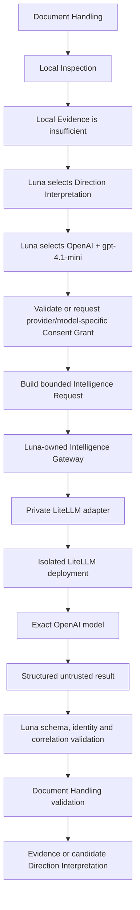

# Intelligence Gateway architecture

ADR 0015 implements ADR 0003's provider-neutral Cloud Assistance boundary.

## Public boundary

`IntelligenceGateway` receives a Luna-owned `IntelligenceRequest` and returns a Luna-owned `UntrustedIntelligenceResult` or `IntelligenceFailure`. The request carries a safe request identifier, Document Arrival correlation, capability, exact provider/model, selected Local Inspection Evidence, bounded content excerpts, expected response schema, Consent Grant reference and execution constraints.

`DocumentIntelligenceService` is the application seam joining protected Document Handling state to that boundary. The frontend supplies only a Document Arrival identifier, exact selection, consent choice, granting Luna Account and optional existing Consent Grant. It cannot construct an arbitrary provider payload.

The production catalogue contains one evaluated route:

| Intelligence Provider | Model | Mode | Harness |
| --- | --- | --- | --- |
| OpenAI | `gpt-4.1-mini` | Luna-managed Intelligence | isolated LiteLLM; remote before external testing |

Luna-managed Intelligence is an entitlement of an eligible paid Household plan and uses provider credentials billed to Luna. A free Household may instead configure a supported Bring-your-own provider connection entirely through Luna's interface, with provider usage billed to the connection owner, or remain Local-only. Paid Households retain those choices. Managed gateway credentials are automatically provisioned to Trusted Devices and are never customer-entered settings.

`DeterministicIntelligenceGateway` implements the same contract for tests and never enters the production registry.

For prototype acceptance, an operator may run the pinned gateway deployment ephemerally on loopback and send only the fixed synthetic canary. This validates the real provider contract without adding LiteLLM or Python to the desktop. Before external testing, the same boundary moves behind authenticated remote HTTPS ingress with managed secrets and attributable gateway credentials.

## Minimisation

For Direction Interpretation, Luna may transmit:

- media type;
- local values for unresolved document fields;
- the names of fields Luna asks the provider to interpret;
- at most 4,000 characters of locally extracted text.

Luna does not transmit the Household identifier, Cabinet or source paths, checksum, Filing Rules, duplicate state, History, credentials, the Original file, or complete Household state. Relevance to a Household, property or Service Provider remains Member Direction and is not requested from the provider.

Before Luna offers reusable consent, the Conversation states its concrete future scope: the exact provider/model and capability, the current media type, the same locally known context values and no wider set of disclosed fields. The protected Consent Grant stores that local-scope Evidence and validates it against every attempted reuse. A changed media type, local context value, provider, model, capability or wider disclosed field set requires a new Consent Grant.

## Validation and authority

The gateway result must echo the request, Document Arrival, provider and model identities. Luna rejects unknown fields, empty or oversized values, malformed structured results and mismatched correlation. Document Handling then rejects candidate fields that already have Member Direction, malformed monetary values and dates that are not valid ISO calendar dates, in addition to its existing bounds and control-character constraints.

The provider result cannot create Member Direction or mutate a Document Arrival. A validated candidate is held in the review interface until a Household Member accepts or corrects it through the existing Member Direction command. History records provider completion and later candidate acceptance, correction or rejection as separate immutable events; an earlier event is never rewritten.

## Failure and retry

Luna maps infrastructure failures to its own categories. Only `ProviderUnavailable`, `GatewayUnavailable` and `TimedOut` receive one bounded retry, using the byte-equivalent Luna request and the same provider/model. LiteLLM receives `num_retries: 0` and an empty fallback list.

Exhausted, invalid, rejected, authentication or rate-limit failures leave Document Handling in `WaitingForCloudAssistance`. Keep local returns it to `NeedsMemberDirection` without a gateway call. Existing Filing Rules and duplicate/version handling never call this gateway and remain offline-capable.
