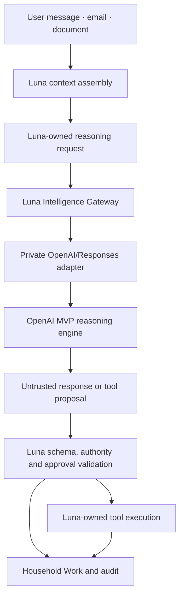

# Intelligence Gateway architecture

**Scope:** Supporting infrastructure for the MVP household-administration agent

The gateway is an execution boundary inside the architecture described in [Agent Architecture](./agent-architecture.md). It is not the product's reasoning model, durable domain or user-facing provider-selection experience.

## MVP route

The MVP uses one Luna-managed OpenAI route through the Responses API. OpenAI reads email, supported attachments and the authorised context assembled by Luna. Local parsing and OCR may support preservation, evidence and validation, but they do not replace the reasoning loop.

## Public boundary

`IntelligenceGateway` receives a Luna-owned request and returns an untrusted result or a Luna-owned failure. The request may contain:

- a Luna-generated request and correlation identifier;
- the relevant recent conversation;
- authorised household context and active work;
- email body and metadata;
- a preserved PDF, JPG or PNG attachment;
- the expected response schema and tool-proposal limits; and
- execution constraints and the applicable Luna permission decision.

The gateway must not accept provider-generated authority, credentials, tool implementations, durable identifiers or direct state mutations. Luna adds and verifies request identity, route identity and audit metadata around the provider result.

## One context-aware contract

The gateway must support the shared household-administration reasoning path. It must not preserve a product boundary in which:

- ordinary Conversation receives only `currentMessage`; and
- Document Intelligence receives a separate bounded field questionnaire.

The provider needs enough relevant context to resolve references, understand the attachment and relate the source to the household. Luna still applies relevance and privacy policy; context minimisation means authorised and relevant, not isolated and unusable.

## Luna-owned execution boundary

OpenAI may return:

- a natural conversational explanation;
- extracted facts with evidence and uncertainty;
- a proposed Household Work update;
- a clarifying question; or
- a proposed tool call with typed arguments.

Luna validates all of these. In particular, Luna verifies source correlation, work identity, allowed fields, value bounds, target and scope, household authority, approval requirements, idempotency and persistence. The model cannot call a tool, send a message, schedule a reminder, alter a provider account or mark work complete directly.

## Credentials and transport

The upstream OpenAI credential remains in the operator-controlled gateway environment. The desktop receives only a narrow, revocable Luna gateway credential in the operating-system vault. Credentials never enter SQLite, Cabinet files, Conversation messages, Household Work, audit content or diagnostics.

The gateway and adapter must disable raw request/response content logging, pin the evaluated model route, use bounded timeouts and retries, and retain only privacy-safe usage metadata. A real remote deployment requires authenticated TLS ingress and abuse controls before external household data is used.

## Failure and recovery

Provider, gateway, validation and authentication failures become Luna-owned failure categories. Safe retries use the same request, provider and model. A failed request leaves the relevant Household Work and source intact in a waiting or blocked state. No fallback provider, model or action is selected silently.

If a result is malformed, over-scoped or correlated to the wrong source, Luna rejects it without changing durable work or consuming approval. A later retry or member decision resumes the same work item.

## Deferred routes

The MVP does not expose local models, local-only reasoning, BYOK, multiple provider choices or per-document provider consent UX. The `IntelligenceGateway` contract may remain replaceable infrastructure for a later route, but these future options must not shape the MVP product or split the reasoning layer.

`DeterministicIntelligenceGateway` remains a test seam and never enters the production registry. ADR 0003 is historical and superseded for the MVP by [ADR 0019](../adr/0019-openai-mvp-household-administration-agent.md). ADR 0015 remains useful only where it describes Luna-owned transport, credential and validation boundaries.
