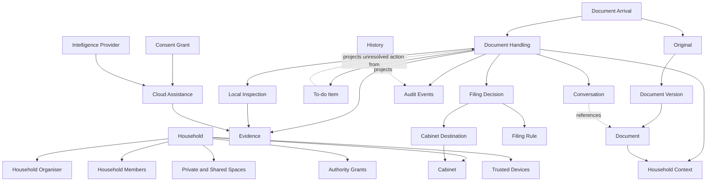
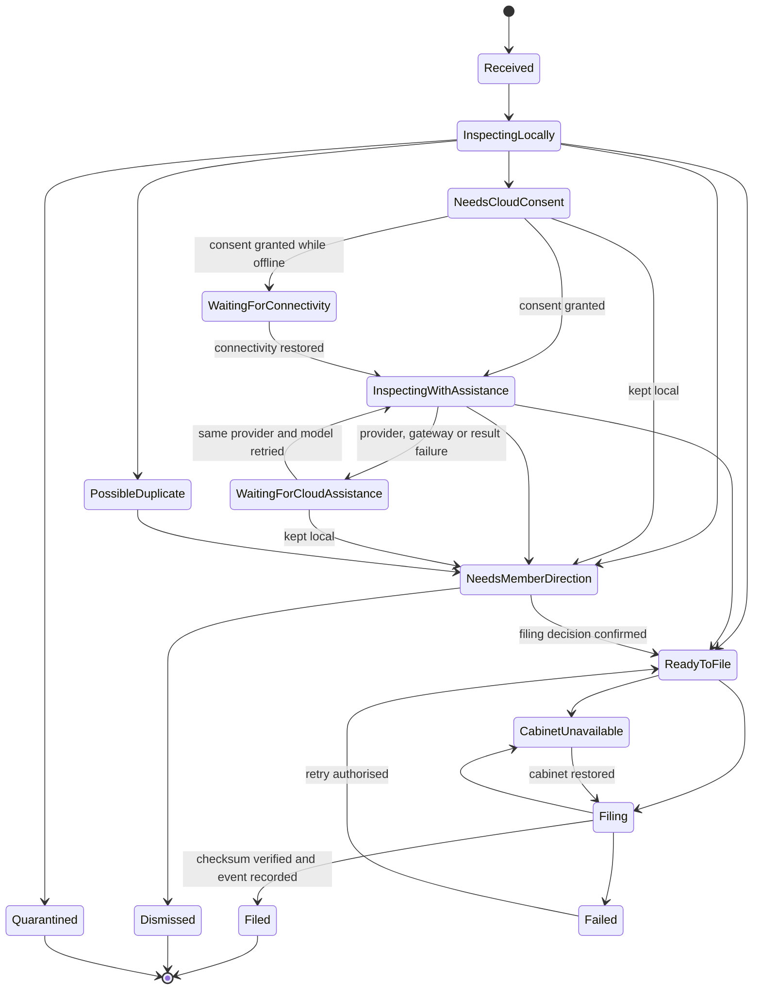

# Luna Domain Model

This document describes the conceptual relationships, invariants and events for Luna's clean-sheet first competency. Canonical terminology lives in [CONTEXT.md](../CONTEXT.md); implementation choices are recorded separately in [ADRs](./adr/).

## Domain focus

Luna's core domain is **Document Handling**: turning an unfamiliar household document into a correctly contextualised, safely filed original and then earning enough trust to handle a genuine future match automatically.

Supporting domain areas are:

- **Household identity and authority** — who belongs to the household, who controls private or shared subjects, and who may provide direction.
- **Cabinet and records** — where originals live, how logical documents relate to arrivals and versions, and what counts as a safe filing.
- **Conversation and attention** — how members teach Luna and how unresolved human action appears without duplicating work.
- **Intelligence and consent** — how local inspection and permission-gated cloud assistance contribute evidence.
- **Device trust and portable memory** — which devices may process protected household state and how that state remains recoverable.

## Conceptual relationships

## Consistency boundaries

### Household

The Household boundary controls membership, private and shared spaces, authority grants, trusted-device membership and household-wide defaults. A Household Organiser may administer the household without gaining implicit access to an Adult Member's Private Space.

### Document

The Document boundary identifies one logical household record and its distinct originals or versions. Arrivals are provenance; versions are preserved records; neither is erased merely because another copy or correction exists.

### Document Handling

Document Handling owns the current lifecycle of one arrival: inspection evidence, unresolved questions, member direction, filing decision, staging and outcome. Conversation cards and To-do Items are views of this same handling state.

### Filing Rule

A Filing Rule is independently visible, editable and revocable. It records the conditions under which Luna may reuse a past Filing Decision; it is not hidden model memory and does not change merely because a conversation is deleted.

### Consent Grant

A Consent Grant is independently visible and revocable. It names the Intelligence Provider, approved model, capability, permitted content, granting member, creation time and document or future scope. A one-time grant is consumed by its first transmission attempt; a reusable grant remains restricted to its declared scope. It never implies permission to use another provider or model.

### Conversation

A Conversation owns member messages and references to durable domain subjects. It does not own documents, handling state, rules, authority or audit history.

### Trusted Device

A Trusted Device controls one device identity and its participation in household cryptographic trust. Account access alone is insufficient to join this boundary.

A Trusted Device must also be locally unlocked with its Device PIN for the current session. Recovery material remains pending until its service registration succeeds, and Device Revocation advances the Household key epoch for every retained device.

## Invariants

1. **Originals are immutable.** Luna may rename or relocate an Original but never silently change its bytes.
2. **The cabinet remains human-owned.** A household can browse and use filed documents without Luna.
3. **Account access is not decryption authority.** Cabinet memory requires a Trusted Device or Recovery Key.
4. **Adult privacy survives household administration.** A Household Organiser has no implicit access to another Adult Member's Private Space.
5. **A Document Arrival survives conversation deletion.** Chat organisation cannot destroy household records or work state.
6. **One handling state has many views.** Conversation, To do, Cabinet and History must not maintain competing copies of Document Handling state.
7. **Unfamiliar context requires Member Direction.** Luna does not infer a Filing Rule merely from model confidence.
8. **Autonomy is scoped.** A Filing Rule applies only when every declared identity and context condition matches.
9. **Changed context suspends autonomy.** A new Service Provider, Addressee, property, account or document type requires renewed direction.
10. **No silent overwrite.** Filing never replaces an existing Original without an explicit member decision.
11. **Duplicate identity is not assumed.** A Possible Duplicate remains distinct until a member or exact-byte match establishes its relationship.
12. **Manual cabinet changes are authoritative.** Luna may ask whether a move teaches a rule but never silently reverses it.
13. **Cloud assistance is provider-specific.** A Consent Grant for one Intelligence Provider cannot authorise another.
14. **No silent fallback.** Provider unavailability creates a waiting state unless a member grants another provider.
15. **Evidence is not authority.** Local or cloud interpretation can propose context but cannot replace Member Direction where direction is required.
16. **Staging ends only after verification.** Luna removes a staged copy only after the cabinet copy is checksum-verified and the outcome is durably recorded.
17. **Rules change prospectively.** Historical reorganisation requires a preview and explicit direction.
18. **Deletion meanings are separate.** Deleting a file does not implicitly delete its Filing Rule, related future obligation, conversation or Audit Events.

## Document Handling lifecycle

## Domain events

Events use past tense because they record facts that have already occurred.

- **DocumentArrived** — a new arrival entered Luna through a known intake source.
- **LocalInspectionCompleted** — local evidence, checksum and confidence states were produced.
- **PossibleDuplicateDetected** — an arrival may represent an existing logical document.
- **MemberDirectionRequested** — unresolved context or a decision was routed to a specific member.
- **MemberDirectionRecorded** — an authorised member supplied or corrected context.
- **CloudAssistanceRequested** — Luna identified a need for external reasoning from a named provider.
- **ConsentGrantRecorded** — a member authorised one cloud use or a scoped future use.
- **CloudAssistanceDenied** — the member kept the document local.
- **FilingDecisionConfirmed** — context, filename and destination were confirmed.
- **DocumentStaged** — an untouched original entered recoverable staging.
- **CabinetBecameUnavailable** — the configured destination could not be used safely.
- **DocumentFiled** — the cabinet copy was verified and the filing outcome recorded.
- **FilingRuleLearned** — a confirmed decision created a visible scoped rule.
- **FilingRuleChanged** — a member paused, edited or removed a rule.
- **ExactMatchHandledAutomatically** — a later arrival satisfied every condition of a Filing Rule.
- **ManualCabinetMoveObserved** — Luna detected an owner-directed filesystem change.
- **DuplicateDecisionRecorded** — a member established how related arrivals or versions should be represented.
- **DocumentDeletionRequested** — a member requested removal and Luna must clarify related lifecycles.
- **TrustedDeviceEnrolled** — a device joined household cryptographic trust.
- **TrustedDeviceRevoked** — a device lost permission to read future protected state.

## Scenario checks

### Recurring bill

The first AGL electricity bill addressed to Sam for Property A requires Member Direction. The resulting Filing Rule may handle the second AGL electricity bill for Sam and Property A automatically.

### Changed service provider

An Origin electricity bill for Property A does not satisfy the AGL Filing Rule. Luna requests Member Direction because the Service Provider changed.

### Changed property

An AGL bill for Property B does not satisfy the Property A rule. Luna first establishes Property B's Household Context and relevance.

### Manual move

When a member moves a filed bill to another folder outside Luna, the move remains in effect. Luna asks whether it should change the Filing Rule or treat the move as an exception.

### Private adult record

A legal document addressed to an Adult Member enters that member's Private Space. The Household Organiser cannot read it without an Authority Grant from that adult.

### Provider outage

If the selected Intelligence Provider is unavailable, the handling waits. Luna does not send content to another provider without a separate Consent Grant.

## Prototype vocabulary mismatches

The existing prototype uses terms that must not define the clean-sheet model:

| Prototype term | Canonical term or distinction |
|---|---|
| Workspace | Household |
| Owner / admin / subscriber | Household Organiser |
| User | Household Member |
| Supplier | Service Provider |
| Task | To-do Item when a human must act |
| Work order | Document Handling for the first competency |
| Approval | Member Direction for non-consequential clarification and filing |
| Cabinet path | Cabinet Destination |
| AI provider / provider | Intelligence Provider |

Approval remains a valid future term for consequential actions such as payments or cancellations; it is not the default term for teaching Luna how to file a document.

The published first-vertical specification and implementation tickets predate this glossary and use **owner** as their primary actor. Interpret that actor as **Household Organiser** until those planning artifacts receive a deliberate vocabulary-normalisation pass.
