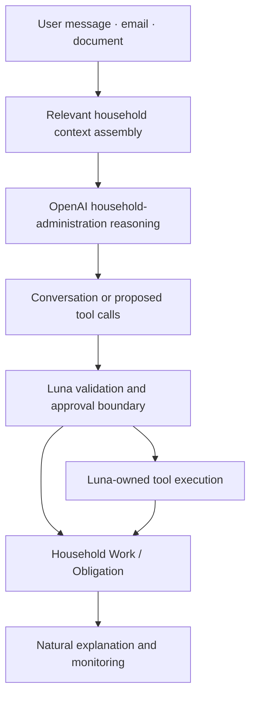
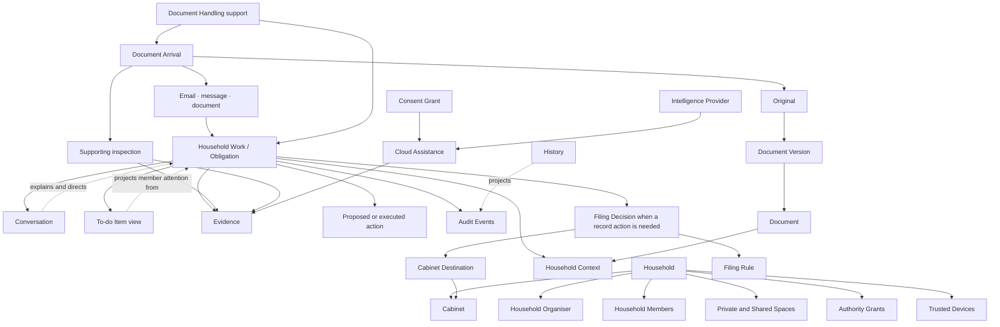
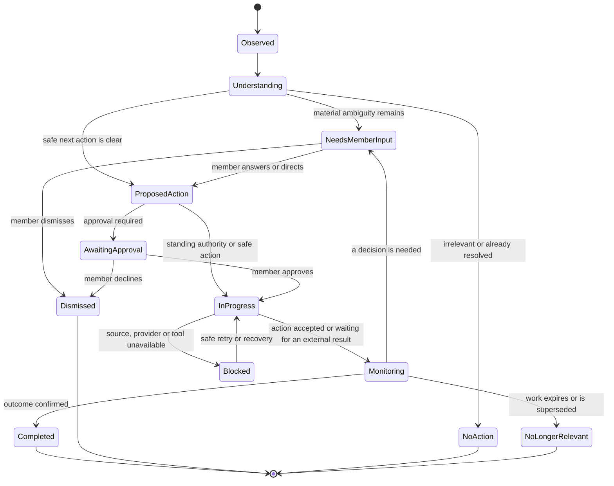

# Luna Domain Model

This document describes the conceptual relationships, invariants and events for Luna's household-administration domain. Canonical terminology lives in [CONTEXT.md](../CONTEXT.md); implementation choices are recorded separately in [ADRs](./adr/). The former document-centred first vertical is retained as implementation history and is assessed in [the MVP reset assessment](./plans/mvp-reset-assessment.md).

## Domain focus

Luna's core domain is **Household Work**: turning incoming household information into a correctly understood, safely progressed and durably monitored piece of administration. An internal work item may be called an `Obligation`.

Supporting domain areas are:

- **Household identity and authority** — who belongs to the household, who controls private or shared subjects, and who may provide direction.
- **Sources and records** — where originals and source references live, how documents relate to arrivals and versions, and how evidence is preserved.
- **Conversation and attention** — how members direct Luna and how Household Work appears without duplicating work.
- **Intelligence and execution** — how OpenAI contributes reasoning and how Luna validates and executes proposals.
- **Device trust and portable memory** — which devices may process protected household state and how that state remains recoverable.

## Interaction principle

Conversation is Luna's primary household interface. A member delegates in ordinary language; Luna derives its understanding and the next materially necessary question from durable work state. Structured Household Context and Filing Decisions remain hidden by default and are available through an optional **Review details** surface for transparency and correction.

Conversation orchestration is an interface boundary, not a new consistency boundary:

OpenAI is the MVP reasoning and document-reading engine. Deterministic inspection and validation may support the agent, but no separate document questionnaire or isolated latest-message path owns interpretation. Intelligence never owns authority, consent, tools or durable work state. Ambiguous interpretations do not execute.

## Conceptual relationships

## Consistency boundaries

### Household

The Household boundary controls membership, private and shared spaces, authority grants, trusted-device membership and household-wide defaults. A Household Organiser may administer the household without gaining implicit access to an Adult Member's Private Space.

### Document

The Document boundary identifies one logical household record and its distinct originals or versions. Arrivals are provenance; versions are preserved records; neither is erased merely because another copy or correction exists.

### Household Work

Household Work owns the current administration lifecycle: why the work exists, what Luna understands, who is responsible, what is due, what action is proposed or authorised, what is waiting and how the work ends. Sources, Conversations, To-do Items, Cabinet records and History project or support this state; none maintains a competing lifecycle.

### Document Handling

Document Handling supports source preservation, local inspection, evidence and filing for a Document Arrival. It may update Household Work, but it is not the product's durable centre.

### Filing Rule

A Filing Rule is independently visible, editable and revocable. It records the conditions under which Luna may reuse a past Filing Decision; it is not hidden model memory and does not change merely because a conversation is deleted.

### Consent Grant

A Consent Grant is independently visible and revocable. It names the Intelligence Provider, approved model, capability, permitted content, granting member, creation time and scope. For the MVP, the managed OpenAI route and Luna-owned context policy provide the normal path; complex per-document consent and provider choice are deferred.

### Conversation

A Conversation owns member messages and is the primary interaction layer for Household Work. It does not own sources, work state, rules, authority or audit history. Explanations, questions and approvals are derived from work state, and accepted replies become validated domain commands rather than persistence mutations.

### Trusted Device

A Trusted Device controls one device identity and its participation in household cryptographic trust. Account access alone is insufficient to join this boundary.

A Trusted Device must also be locally unlocked with its Device PIN for the current session. Recovery material remains pending until its service registration succeeds, and Device Revocation advances the Household key epoch for every retained device.

Portable Memory Records carry only typed durable facts and opaque owning-domain UUID references. Conversation, Filing Rule, duplicate and Cloud Assistance owners capture their consequential facts automatically; credential-vault operations are outside that adapter, Filing Rules never manufacture Authority Grants, and Keep local never manufactures a denied Consent Grant. A Trusted Device signs each encrypted append-only record with its device-held authorisation key. The local database commits a record before Cabinet delivery, so an unavailable Cabinet leaves an exact pending record for later synchronisation. Import verifies the signed public chain metadata and device activation/revocation validity window before decrypting with the correct Household key epoch, then rebuilds executable Filing Rules and reusable Consent Grants plus protected relationship and History projections in their owning local stores. Reusable Consent retains the exact provider, model, permitted disclosure names and field/value evidence scope required by the owning validator. One-time grants remain portable historical authority and identify their Document through a canonical Portable Reference, but are not rebound as executable Consent to a different device's local Document Arrival. The Recovery Key protects the complete historical Household-key ring so a device recovered after rotation can rebuild pre-rotation History without restoring access to a revoked device. Competing mutable facts or opposing resolution events become a Portable Memory Conflict; the affected current projection, including Filing Rule automation, is withheld until explicit resolution and neither record silently overwrites the other.

## Invariants

1. **Originals are immutable.** Luna may rename or relocate an Original but never silently change its bytes.
2. **The cabinet remains human-owned.** A household can browse and use filed documents without Luna.
3. **Account access is not decryption authority.** Cabinet memory requires a Trusted Device or Recovery Key.
4. **Adult privacy survives household administration.** A Household Organiser has no implicit access to another Adult Member's Private Space.
5. **Household Work survives conversation deletion.** Chat organisation cannot destroy household work, sources or outcomes.
6. **One work state has many views.** Conversation, To do, sources, Cabinet and History must not maintain competing copies of Household Work state.
7. **Evidence is understood before asking.** Luna uses available email, attachments, context, prior conversation and decisions before requesting a member input.
8. **Autonomy is scoped.** A Filing Rule applies only when every declared identity and context condition matches.
9. **Changed context suspends autonomy.** A new Service Provider, Addressee, property, account or document type requires renewed direction.
10. **No silent overwrite.** Filing never replaces an existing Original without an explicit member decision.
11. **Duplicate identity is not assumed.** A Possible Duplicate remains distinct until a member or exact-byte match establishes its relationship.
12. **Manual cabinet changes are authoritative.** Luna may ask whether a move teaches a rule but never silently reverses it.
13. **Luna owns the intelligence boundary.** OpenAI or another future engine cannot authenticate, mutate durable work, execute a tool or grant authority.
14. **No silent route or action fallback.** Provider or tool unavailability creates a waiting state; Luna never changes provider, target or action scope without a valid decision.
15. **Evidence is not authority.** Model interpretation can propose facts or actions but cannot replace member direction or approval where required.
16. **Staging ends only after verification.** Luna removes a staged copy only after the cabinet copy is checksum-verified and the outcome is durably recorded.
17. **Rules change prospectively.** Historical reorganisation requires a preview and explicit direction.
18. **Deletion meanings are separate.** Deleting a source or conversation does not implicitly delete related Household Work, decisions, actions or Audit Events.
19. **Portable memory contains durable facts only.** Filing Rules, relationships, Member Direction, authority, Consent Grants, outcomes, Audit Events and stable references may cross devices; derived prompts, transient orchestration, hidden reasoning and raw provider output do not.
20. **Secrets never become portable memory.** Credentials, tokens, device private keys and plaintext encryption keys remain in their owning credential boundary.
21. **Portable delivery is append-only and idempotent.** A duplicate record has no additional effect, an interrupted Cabinet write can be repaired from the exact committed record across key rotation, and modified, replay-invalid, post-revocation or untrusted records are rejected.
22. **Concurrent portable state never silently overwrites.** Valid competing changes to one mutable subject remain detectable until an explicit resolution selects the current projection.
23. **Each Trusted Device owns a separate local database.** The Cabinet carries Portable Memory Records, never a live database file.
24. **Conversation is an interface, not a work owner.** Deleting dialogue cannot delete or rewrite Household Work, sources, authority, Filing Rules or Audit Events.
25. **Member effort is minimised.** Luna asks only for materially necessary unresolved information and does not require a member to construct a filename or Cabinet Destination unless they choose to override the proposal.
26. **Interpretation is not execution.** A model proposal or Member Utterance changes durable state or calls a tool only after Luna-owned validation, authority and approval checks; ambiguous interpretations do not execute.

## Household Work lifecycle

## Domain events

Events use past tense because they record facts that have already occurred.

- **HouseholdWorkCreated** — incoming information created a durable piece of household work.
- **HouseholdWorkUpdated** — new source evidence or a member decision changed the work's understanding, responsibility, urgency or status.
- **ActionProposed** — Luna proposed a next action and recorded its target, scope and evidence.
- **ApprovalRequested** — Luna identified that a member decision or approval is required.
- **ActionApproved** — an authorised member approved a validated action.
- **ActionExecuted** — Luna executed an approved or standing-authority action and recorded the outcome.
- **HouseholdWorkCompleted** — the work reached a confirmed successful outcome.
- **HouseholdWorkDismissed** — a member explicitly dismissed the work.
- **HouseholdWorkBecameIrrelevant** — the work no longer requires attention because it expired, was superseded or was otherwise resolved.
- **HouseholdWorkBlocked** — a source, provider, tool or authority condition prevents safe progress.
- **DocumentArrived** — a new arrival entered Luna through a known intake source.
- **LocalInspectionCompleted** — local evidence, checksum and confidence states were produced.
- **PossibleDuplicateDetected** — an arrival may represent an existing logical document.
- **MemberDirectionRequested** — unresolved context or a decision was routed to a specific member.
- **MemberDirectionRecorded** — an authorised member supplied or corrected context.
- **CloudAssistanceRequested** — Luna identified a need for external reasoning from a named provider.
- **ConsentGrantRecorded** — a member authorised one cloud use or a scoped future use.
- **CloudAssistanceDenied** — the member kept the document local.
- **FilingDecisionConfirmed** — context, filename and destination were confirmed.
- **DocumentStaged** — an untouched original entered recoverable staging.
- **CabinetBecameUnavailable** — the configured destination could not be used safely.
- **DocumentFiled** — the cabinet copy was verified and the filing outcome recorded.
- **FilingRuleLearned** — a confirmed decision created a visible scoped rule.
- **FilingRuleChanged** — a member paused, edited or removed a rule.
- **ExactMatchHandledAutomatically** — a later arrival satisfied every condition of a Filing Rule.
- **ManualCabinetMoveObserved** — Luna detected an owner-directed filesystem change.
- **DuplicateDecisionRecorded** — a member established how related arrivals or versions should be represented.
- **DocumentDeletionRequested** — a member requested removal and Luna must clarify related lifecycles.
- **TrustedDeviceEnrolled** — a device joined household cryptographic trust.
- **TrustedDeviceRevoked** — a device lost permission to read future protected state.

## Scenario checks

### Recurring bill

An AGL electricity bill arrives by email. Luna reads the message and attachment, creates Household Work with provider, amount, due date, property and account facts, explains it in Conversation and proposes a reminder or other appropriate next action. It asks for direction only when available evidence and household context do not resolve responsibility or authority.

### Changed service provider

An Origin electricity bill for Property A does not satisfy the AGL Filing Rule. Luna requests Member Direction because the Service Provider changed.

### Changed property

An AGL bill for Property B does not satisfy the Property A rule. Luna first establishes Property B's Household Context and relevance.

### Manual move

When a member moves a filed bill to another folder outside Luna, the move remains in effect. Luna asks whether it should change the Filing Rule or treat the move as an exception.

### Private adult record

A legal document addressed to an Adult Member enters that member's Private Space. The Household Organiser cannot read it without an Authority Grant from that adult.

### Provider outage

If OpenAI or an execution tool is unavailable, the Household Work remains durable and visibly blocked or waiting. Luna retries the same safe route within bounded rules and does not silently change provider, target or action scope.

## Prototype vocabulary mismatches

The existing prototype uses terms that must not define the clean-sheet model:

| Prototype term | Canonical term or distinction |
|---|---|
| Workspace | Household |
| Owner / admin / subscriber | Household Organiser |
| User | Household Member |
| Supplier | Service Provider |
| Task | To-do Item when a human must act |
| Work order | Household Work / internal Obligation |
| Approval | Member Direction for non-consequential clarification and filing |
| Cabinet path | Cabinet Destination |
| AI provider / provider | Intelligence Provider |

Approval remains a valid future term for consequential actions such as payments or cancellations; it is not the default term for teaching Luna how to file a document.

The published first-vertical specification and implementation tickets predate this glossary and use **owner** as their primary actor. Interpret that actor as **Household Organiser** until those planning artifacts receive a deliberate vocabulary-normalisation pass.
