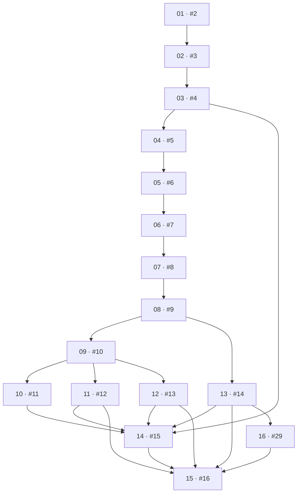

# Luna First Vertical — Implementation Tickets

This review document decomposes [specification issue #1](https://github.com/yasserchehade/Luna/issues/1) into small, dependency-aware tracer-bullet tickets.

- Status: approved and published
- Tracker: private GitHub repository
- Interaction model: conversation-first under ADR 0010
- Delivery status: conversation-first stabilization (#29) is published in PR [#59](https://github.com/yasserchehade/Luna/pull/59) on current `main`; final GitHub Actions verification remains required before merge
- Development strategy: complete the unfamiliar-document-to-learned-automation path depth-first, implementing only dependencies that genuinely block it

## Dependency chart

An arrow means **dependee/blocker → dependent ticket**.

The main value spine is tickets 01–09. Tickets 10–13 deepen transparency, duplicate handling, cloud reasoning and resilience. Ticket 14 reunites those branches through portable encrypted memory. Ticket 16 applies the conversation-first interaction decision, and ticket 15 is final cross-platform verification.

## Ticket index

| Ticket | GitHub | Title | Blocked by |
|---|---:|---|---|
| 01 | [#2](https://github.com/yasserchehade/Luna/issues/2) | Bootstrap the clean-sheet Luna desktop | None |
| 02 | [#3](https://github.com/yasserchehade/Luna/issues/3) | Create the required Luna account and household | 01 |
| 03 | [#4](https://github.com/yasserchehade/Luna/issues/4) | Enrol and recover a trusted device | 02 |
| 04 | [#5](https://github.com/yasserchehade/Luna/issues/5) | Give Luna a desk and create the cabinet | 03 |
| 05 | [#6](https://github.com/yasserchehade/Luna/issues/6) | Attach a document to a durable conversation | 04 |
| 06 | [#7](https://github.com/yasserchehade/Luna/issues/7) | Inspect a document locally | 05 |
| 07 | [#8](https://github.com/yasserchehade/Luna/issues/8) | Clarify household context and choose a destination | 06 |
| 08 | [#9](https://github.com/yasserchehade/Luna/issues/9) | File and verify an untouched original | 07 |
| 09 | [#10](https://github.com/yasserchehade/Luna/issues/10) | Learn a filing rule and automate the next match | 08 |
| 10 | [#11](https://github.com/yasserchehade/Luna/issues/11) | Expose learned behaviour and owner corrections | 09 |
| 11 | [#12](https://github.com/yasserchehade/Luna/issues/12) | Resolve duplicates and document versions | 09 |
| 12 | [#13](https://github.com/yasserchehade/Luna/issues/13) | Add consent-gated cloud intelligence | 09 |
| 13 | [#14](https://github.com/yasserchehade/Luna/issues/14) | Survive offline and unavailable-cabinet conditions | 08 |
| 14 | [#15](https://github.com/yasserchehade/Luna/issues/15) | Synchronise encrypted portable Luna memory | 03, 10, 11, 12, 13 |
| 15 | [#16](https://github.com/yasserchehade/Luna/issues/16) | Verify the complete cross-platform golden path | 11, 12, 13, 14, 16 |
| 16 | [#29](https://github.com/yasserchehade/Luna/issues/29) | Make Conversation the primary document interface | 13 |

## 01 — Bootstrap the clean-sheet Luna desktop

**GitHub:** [#2](https://github.com/yasserchehade/Luna/issues/2)
**Blocked by:** None — can start immediately.

**What it delivers:** A launchable Tauri, React and Rust application with Windows/macOS builds, the five primary destinations, a local database and the shared application-level acceptance-test seam.

### Acceptance criteria

- [ ] The application launches in development on Windows and macOS.
- [ ] The shell exposes Luna, To do, Cabinet, History and Options without reusing the previous workbench design.
- [ ] A per-device local database persists and reloads a small application setting.
- [ ] Cross-platform CI builds the desktop shell on Windows and macOS.
- [ ] An application-level seam exists for submitting work and observing user-visible state.

## 02 — Create the required Luna account and household

**GitHub:** [#3](https://github.com/yasserchehade/Luna/issues/3)
**Blocked by:** 01 / #2.

**What it delivers:** A first owner can register, sign in and create the household that employs Luna, establishing durable identity before sensitive cabinet work begins.

### Acceptance criteria

- [ ] A new owner can register and verify a Luna account.
- [ ] The owner can sign in again and return to the same household.
- [ ] The household records one owner while remaining compatible with future private and shared adult spaces.
- [ ] Authentication failures do not reveal whether another person’s account exists.
- [ ] The account-and-household journey is covered through the application seam.

## 03 — Enrol and recover a trusted device

**GitHub:** [#4](https://github.com/yasserchehade/Luna/issues/4)
**Blocked by:** 02 / #3.

**What it delivers:** The owner’s first desktop becomes a trusted Luna device with protected keys, authenticator MFA and recovery that remains separate from account-password recovery.

### Acceptance criteria

- [ ] The owner can configure authenticator-based MFA.
- [ ] The device creates its own key pair and protects private material in the operating-system credential vault.
- [ ] Onboarding generates an offline household recovery key and requires confirmation.
- [ ] Resetting the Luna account password does not decrypt household memory.
- [ ] A recovery-key flow can enrol a replacement trusted device.
- [ ] A revoked or incorrectly keyed device cannot read encrypted household state.

## 04 — Give Luna a desk and create the cabinet

**GitHub:** [#5](https://github.com/yasserchehade/Luna/issues/5)
**Blocked by:** 03 / #4.

**What it delivers:** The owner chooses Luna’s local or cloud-synchronised desk, reviews a suggested household cabinet and creates an ordinary folder structure they continue to own.

### Acceptance criteria

- [ ] The owner can select a writable filesystem folder using a native picker.
- [ ] Luna previews a recommended cabinet preset before changing the filesystem.
- [ ] The owner can rename, add or remove suggested cabinet sections.
- [ ] No folders are created until the owner confirms the preview.
- [ ] Created folders are human-readable and usable outside Luna.
- [ ] Luna remembers and validates the cabinet on the next launch.

## 05 — Attach a document to a durable conversation

**GitHub:** [#6](https://github.com/yasserchehade/Luna/issues/6)
**Blocked by:** 04 / #5.

**What it delivers:** The owner starts a familiar Luna conversation, attaches a supported document and can trust that the arrival persists independently while unresolved action appears in To do.

### Acceptance criteria

- [ ] The owner can create, rename, search, archive and delete conversations.
- [ ] A PDF, JPG or PNG can be attached through selection or drag-and-drop.
- [ ] The document arrival remains durable if its conversation is deleted.
- [ ] Processing state is visible in the originating conversation.
- [ ] Required owner action appears once in To do and opens the exact item.
- [ ] Resolving work in either surface updates the same durable state.

## 06 — Inspect a document locally

**GitHub:** [#7](https://github.com/yasserchehade/Luna/issues/7)
**Blocked by:** 05 / #6.

**What it delivers:** Luna performs a privacy-preserving first read that validates and fingerprints a document, extracts local text or OCR, preserves the original and presents understandable evidence.

### Acceptance criteria

- [ ] Luna validates actual file type and safely rejects unsupported or malformed input.
- [ ] The exact original bytes and original filename are preserved.
- [ ] Luna calculates and records a cryptographic checksum.
- [ ] Text is extracted locally from digital PDFs.
- [ ] JPG, PNG and image-only PDF content can be OCRed locally without modifying the original.
- [ ] The conversation shows a structured review card with evidence and plain-language confidence.
- [ ] No document content leaves the device.

## 07 — Clarify household context and choose a destination

**GitHub:** [#8](https://github.com/yasserchehade/Luna/issues/8)
**Blocked by:** 06 / #7.

**What it delivers:** Luna asks focused questions about an unfamiliar document and turns the owner’s answers into confirmed context and a filing decision.

### Acceptance criteria

- [ ] The review card represents document type, provider, addressee, property, account, amount, dates and destination.
- [ ] Luna asks only unresolved questions that can change identity, context or filing.
- [ ] The owner can correct any extracted field.
- [ ] A new provider or address remains unresolved until the owner explains its relevance.
- [ ] Luna proposes a readable filename and cabinet path from confirmed context.
- [ ] The owner can edit and confirm the destination.
- [ ] An unfamiliar document cannot proceed as if its context were confirmed.

## 08 — File and verify an untouched original

**GitHub:** [#9](https://github.com/yasserchehade/Luna/issues/9)
**Blocked by:** 07 / #8.

**What it delivers:** Luna presents one readable conversational confirmation for a complete proposed Household Context and Filing Decision, then safely stages, files and verifies the untouched Original while Conversation, To do, Cabinet and History report one consistent outcome.

### Acceptance criteria

- [ ] Complete local Evidence produces one conversational confirmation before the first filing; Evidence alone does not authorise it.
- [ ] An affirmative Member Direction passes owning-domain validation and records the acting authority.
- [ ] Luna stages the original before a cabinet write.
- [ ] Generated paths stay inside the cabinet and are valid on Windows and macOS.
- [ ] Existing files are never overwritten silently.
- [ ] The filed copy matches the staged checksum.
- [ ] Luna records original name, final path, checksum, source and filing decision.
- [ ] Staging is removed only after verification and durable event recording.
- [ ] Conversation, To do, Cabinet and History agree that filing completed.

## 09 — Learn a filing rule and automate the next match

**GitHub:** [#10](https://github.com/yasserchehade/Luna/issues/10)
**Blocked by:** 08 / #9.

**What it delivers:** After filing, Luna separately offers to learn the confirmed decision. Only an explicit Member Direction such as **Always do this** creates a Filing Rule; a later genuine match can then be handled automatically.

### Acceptance criteria

- [ ] Filing completes without silently creating a Filing Rule.
- [ ] Luna separately presents the proposed rule in plain language after filing.
- [ ] A rule is learned only from explicit Member Direction.
- [ ] A rule can match document type, provider, addressee and property or account.
- [ ] A second exact contextual match files automatically.
- [ ] Changed provider, addressee, property, account or document type does not inherit the rule silently.
- [ ] Automatic filing preserves transactional verification and audit behaviour.
- [ ] The accepted golden path passes through the application seam.

## 10 — Expose learned behaviour and owner corrections

**GitHub:** [#11](https://github.com/yasserchehade/Luna/issues/11)
**Blocked by:** 09 / #10.

**What it delivers:** Household Members get a transparent rulebook in Options while Conversation remains the primary place to direct Luna. Direct Cabinet changes become authoritative teaching moments rather than actions Luna reverses.

### Acceptance criteria

- [ ] Options lists every rule, its scope, teacher, creation time and affected documents.
- [ ] The owner can pause, edit and delete a rule.
- [ ] Rule edits apply prospectively by default.
- [ ] Historical reorganisation shows an exact preview and requires approval.
- [ ] A manual Document move prompts a conversational question about whether it teaches a rule or is a one-off.
- [ ] Review details exposes the supporting rule and evidence without owning separate Document Handling state.
- [ ] Luna never silently reverses an owner’s move.
- [ ] Rule and correction decisions appear in History.

## 11 — Resolve duplicates and document versions

**GitHub:** [#12](https://github.com/yasserchehade/Luna/issues/12)
**Blocked by:** 09 / #10.

**What it delivers:** A Household Member controls the first duplicate decision through Conversation, while Review details can expose evidence and relationships. Luna learns a narrow Exact Duplicate preference only through separate explicit direction.

### Acceptance criteria

- [ ] Exact byte duplicates and likely semantic duplicates are distinguished.
- [ ] The first duplicate is explained conversationally and offers keep both, link copies, discard or updated version.
- [ ] Natural-language and inline-action answers submit the same validated duplicate command.
- [ ] The member can create a separately explicit scoped future preference for Exact Duplicates.
- [ ] Exact-duplicate preference does not apply to similar files with changed bytes.
- [ ] Updated versions retain both originals and an explicit relationship.
- [ ] Duplicate handling never overwrites an existing document.
- [ ] Decisions and provenance appear in Conversation and History.

## 12 — Add consent-gated cloud intelligence

**GitHub:** [#13](https://github.com/yasserchehade/Luna/issues/13)
**Blocked by:** 09 / #10.

**What it delivers:** Difficult Documents can use one evaluated Luna-managed Intelligence Provider without surrendering provider neutrality, Luna-owned authority or explicit privacy boundaries. Cloud Assistance produces Evidence or candidate Direction Interpretations, never authority.

### Acceptance criteria

- [ ] A Luna-owned provider-neutral Intelligence Gateway returns validated Evidence and typed candidate Direction Interpretations without action authority.
- [ ] OpenAI `gpt-4.1-mini` passes the document evaluation contract through the provisional isolated LiteLLM adapter. For prototype acceptance the real-provider canary may use an ephemeral operator-run loopback deployment; the deterministic test gateway passes the same contract without a paid call.
- [ ] Luna selects and names the exact provider/model and conversationally explains the bounded disclosure before offering Allow once, scoped future consent or Keep local.
- [ ] One-time and reusable Consent Grants bind provider, model, capability, member and disclosed scope; they are inspectable and revocable.
- [ ] Luna-managed upstream provider credentials remain server-side. Luna automatically provisions the desktop's narrow gateway credential into the operating-system vault; members cannot paste it, and it never enters SQLite, frontend storage, Cabinet content or History.
- [ ] Provider, model, schema and owning-domain validation treat every external result as untrusted and prevent direct durable-state mutation.
- [ ] Safe retry uses only the unchanged provider/model; failure leaves Document Handling waiting and never silently switches providers.
- [ ] Existing Filing Rules, duplicate handling and Document Version preservation continue without gateway availability.
- [ ] History records provider, model, reason, Consent Grant, outcome and candidate disposition without secrets or document content.
- [ ] LiteLLM remains private infrastructure replaceable by Portkey, a direct adapter or another gateway without changing Document Handling.

## 13 — Survive offline and unavailable-cabinet conditions

**GitHub:** [#14](https://github.com/yasserchehade/Luna/issues/14)
**Blocked by:** 08 / #9.

**What it delivers:** Luna continues known local work, explains waiting and recovery states in Conversation, and recovers safely from connectivity or Cabinet failure without guessing, losing Originals or redirecting files.

### Acceptance criteria

- [ ] Known learned-rule filing completes offline when the cabinet is available.
- [ ] An unfamiliar document needing deeper intelligence waits explicitly and Luna explains the state conversationally while offline.
- [ ] An unavailable cabinet leaves the untouched Original in the household-owned, checksum-addressed `Incoming` Cabinet folder defined by ADR 0009; protected handling metadata remains encrypted.
- [ ] Luna never chooses a different cabinet because the configured one is unavailable.
- [ ] Retry removes staging only after checksum verification and durable Audit Event recording.
- [ ] Persistent unavailability or time risk creates one clear To do item and one coherent conversational status.
- [ ] Interrupted filing resumes without duplicate files, lost authority context or missing History.
- [ ] The Review Card exposes checksum-bound recovery evidence without adding a second execution path.

## 14 — Synchronise encrypted portable Luna memory

**GitHub:** [#15](https://github.com/yasserchehade/Luna/issues/15)
**Blocked by:** 03 / #4, 10 / #11, 11 / #12, 12 / #13 and 13 / #14.

**What it delivers:** Durable household behaviour and History become portable across Trusted Devices through signed encrypted records beside the Cabinet, while every device retains a separate local database. Derived prompts and model output do not become household memory.

### Acceptance criteria

- [ ] The cabinet contains a reserved encrypted portable-memory area.
- [ ] Portable records are encrypted, signed and append-only.
- [ ] API keys, tokens, device private keys and plaintext secrets never enter portable memory.
- [ ] Portable records include Filing Rules, Document relationships, Member Direction, authority, Consent Grants, execution outcomes, Audit Events and stable references to relevant Conversation messages.
- [ ] Derived Conversation Prompts, transient Conversation Orchestration state, hidden reasoning and raw Intelligence Provider output are not synchronised.
- [ ] A new Trusted Device rebuilds rules, relationships and History into its local database.
- [ ] Duplicate event delivery is idempotent and modified or invalid replayed records are rejected.
- [ ] Concurrent events produce a detectable, resolvable conflict rather than silent overwrite.
- [ ] No live database is synchronised through the cabinet.

## 15 — Verify the complete cross-platform golden path

**GitHub:** [#16](https://github.com/yasserchehade/Luna/issues/16)
**Blocked by:** 11 / #12, 12 / #13, 13 / #14, 14 / #15, 16 / #29 and remote managed-access gate #53. Household entitlement infrastructure #57 is complete.

**What it delivers:** Luna's conversation-first document competency is proven dependable on Windows and macOS before adjacent beta features expand.

**Delivery status (30 July 2026):** issue #29 and the issue #16 review slice are merged. The linked beta account database is migrated through `202607280014`. The founder Household and a separate MFA-protected canary Household have small, expiring complimentary Managed Intelligence Entitlements through the operator-only server path; the canary is a Household Organiser only and is not a platform administrator. ADR 0018's no-separate-host-cost Cloudflare Tunnel is healthy on `silikin.com`; the two hostnames, Service Auth-only administration policy, Supabase secrets, active provisioning/reconciliation functions and pinned gateway stack are live. A fresh bounded real-provider canary passed and its logs were credential/content clean. Founder review exposed and now locks down the offline-notice grid placement and long Cabinet-card overflow. Protected portable-memory recovery can no longer suppress managed credential provisioning after Trusted Device authorization, and the status notice names the failing subsystem rather than declaring the whole app offline. After correcting the administration URL and rotated Cloudflare Service Auth identifier, the rebuilt founder Trusted Device provisioned its narrow managed credential and reconciliation completed with zero failures. Issue #38 is now adapted on `codex/issue-38-managed-conversation`: Options owns the exact default route and separate Conversation/Document permissions; ordinary messages send only the new message; Document Review Cards use the default without their own provider or consent selector; provider output has no tool or Household authority. The isolated MFA canary proves the installed first-device, managed-key, exact-default, Conversation-permission, Enter-send and real OpenAI reply journey. The rebuilt founder app independently proves Managed access ready, the exact GPT-4.1 mini default, enabled Conversation permission and a nonempty reply to an Enter-submitted synthetic message while unrelated recovery warnings remain non-blocking. Managed credential revocation plus signed beta artifacts remain pending.

### Acceptance criteria

- [ ] The unfamiliar-document-to-explicitly-learned-automation path passes repeatedly on Windows and macOS through natural conversation.
- [ ] Complete Evidence produces one readable confirmation; incomplete Evidence produces one focused clarification at a time.
- [ ] Negative, ambiguous, unsupported and stale replies never execute and recover safely in Conversation.
- [ ] Changed Service Provider, property and Addressee variants return to clarification.
- [ ] Filing Rule learning remains a separate explicit Member Direction after filing.
- [ ] Duplicate resolution, denied cloud permission, provider outage, offline work and cabinet recovery pass through the visible seam.
- [ ] Interrupted filing never loses or silently overwrites an original.
- [ ] No provider fallback occurs without consent.
- [ ] No credential or plaintext key appears in cabinet records, portable events, logs or crash output.
- [ ] Keyboard and accessibility checks pass for attachment, the conversation composer, inline actions, Review details, To do and Cabinet selection.
- [ ] In Conversation, `Enter` sends, `Shift+Enter` inserts a newline and IME composition never submits early.
- [ ] The designated founder/test Household receives complimentary capped Managed Intelligence through server-side entitlement and Trusted Device provisioning; no account identity, provider credential or entitlement secret is hard-coded in the desktop or public source.
- [ ] Signed installable beta artifacts and smoke-test evidence exist for both operating systems.

## 16 — Make Conversation the primary document interface

**GitHub:** [#29](https://github.com/yasserchehade/Luna/issues/29)
**Blocked by:** 13 / #14 as the delivery-stack base.

**What it delivers:** Conversation Orchestration derives the next materially necessary prompt from durable Document Handling state. Natural-language replies become typed candidate directions, owning-domain validation remains authoritative and Review details is optional transparency rather than a form-driven primary workflow.

### Acceptance criteria

- [x] A Household Member delegates document handling and answers Luna through the conversation composer.
- [x] Complete local Evidence produces one Filing Decision confirmation; incomplete Evidence produces one focused clarification at a time.
- [x] Negative, ambiguous, unsupported and stale replies cannot execute consequential actions.
- [x] Direction Interpretation submits typed candidates through owning-domain validation.
- [x] Local Inspection and authorised Cloud Assistance remain Evidence, never authority.
- [x] Review details exposes evidence and corrections without owning separate Document Handling state.
- [x] Filing Rule learning is a separate explicit Member Direction after filing.
- [x] Conversation deletion does not delete Document Handling, Filing Rules or Audit Events.
- [x] Keyboard and accessibility coverage includes the composer, inline actions and Review details.

## Execution guidance

Follow the dependency frontier and complete each ticket's full quality gate before merging dependent work. Stacked draft pull requests may expose already implemented local work for review while GitHub Actions credits are unavailable, but they remain draft and their issues remain open until the required CI and review evidence exists. Do not close or repurpose the parent specification issue.
